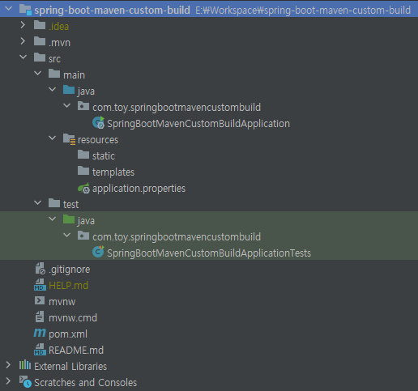

# Spring Boot + Maven 환경에서 커스텀 빌드하기 (1)
---


현재 나는 솔루션 회사에 근무하고 있다. 여러 업무 중 하나로 API 서버를 개발/유지보수하고 있다.<br>
솔루션에는 대부분 기능의 표준이 존재하지만, 고객의 <b>강력한</b> 요청에 의해 표준의 경계가 흐려지거나 망가지는 케이스가 많다. (경험상)<br>
API 서버라고 예외는 없다. 고객의 <b>강력한</b> 커스터마이징 요청이 있었고, 이를 대응하기 위해 하나의 프로젝트에서 고객사별로 커스텀 빌드가 가능하도록 처리한 내용을 정리하려고 한다.

```
개인적으로 하는 개발과 달리 다소 제약적인 회사 내, 개발 환경이라는 점 참고 바랍니다.

[AS-IS]
* 공통 코드는 하나의 단독 프로젝트로 관리한다.
* 커스터마이징 코드는 공통 코드와는 분리된 별도의 프로젝트로 관리하며, 저장소 위치도 다르다.
* 커스터마이징 개발의 경우, 커스터마이징 코드에 공통 코드를 Import Module 하여 개발한다.

나는 개인적으로 이런 낯선 개발 환경/방식을 스스로 풀어나가는 걸 좋아한다.
하지만, 문제는 새로 입사하신 분들 중에는 빠르게 정답만 알고 싶어하시는 분이 있다는 점이다.
그럴 때마다 듣는 사람도 심드렁하고, 알려주는 보람도 없는 일을 더 이상 하기 싫어졌다.

커스터마이징 코드 관리 전략을 스스로 생각하기에 좋은 패턴으로 개선한 내용을 소개하려고 한다.

[TO-BE]
* 공통 코드는 하나의 단독 프로젝트로 관리한다.
* 커스터마이징 코드는 공통 코드와 동일한 프로젝트에 관리하며, 저장소 위치도 동일하다.
* 커스터마이징 개발의 경우, 추가 작업 없이 바로 개발이 가능하다.
* 단, 커스터마이징 코드는 정해진 hierarchy 규칙에 따라 관리/개발한다.

AS-IS 구조의 개발이 안좋다고 말하려는 것이 아니다.
정답은 없다고 생각하며, 또 다른 하나의 방법을 제시하는 것이다.

글로만 전달하려고 하니, 괜한 오해가 있을까봐 말이 길어진다...
커스터마이징 너무 싫다... 조금만 줄이고 싶다...
```

<b>프로젝트 준비</b><br>
